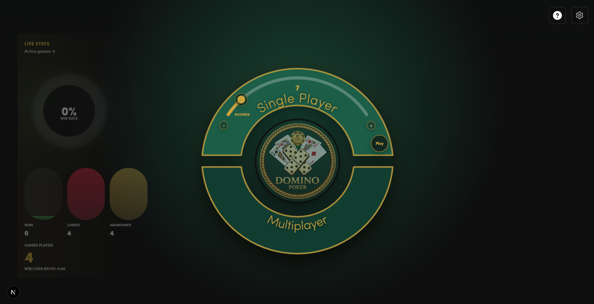
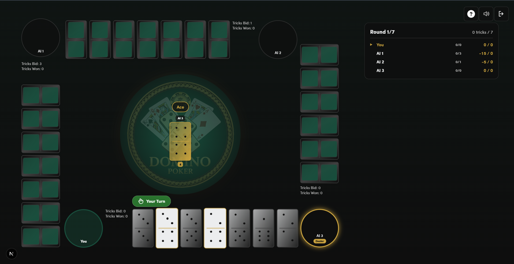
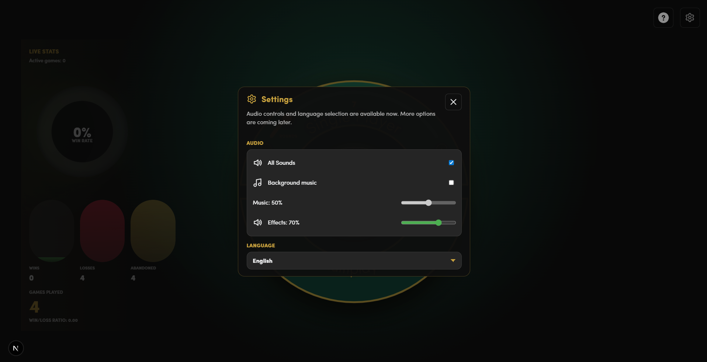
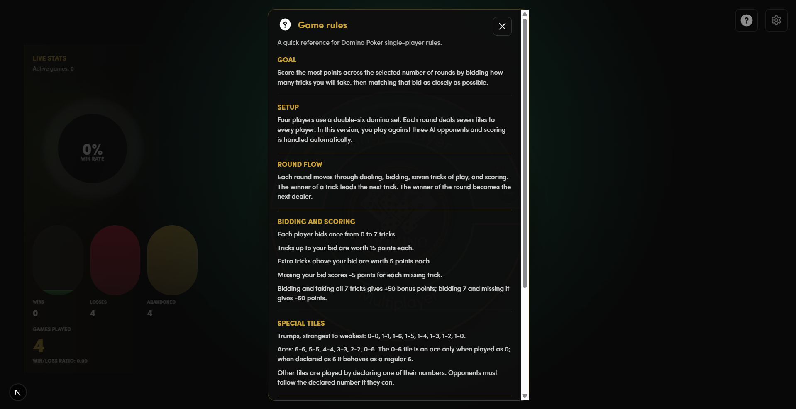

# Domino Poker

Browser-playable **Domino Poker** built with Next.js, React, and TypeScript. The game runs locally in the browser as a single-player table: one human player competes against three bots using a double-six domino set.



## Overview

Domino Poker is a trick-taking domino game where each round starts with bidding, then players compete across seven tricks. The goal is to score the most points by predicting how many tricks you will win and playing your tiles according to the trump, ace, and follow-number rules.

This repository contains a local-only implementation with:

- A polished browser lobby and game table.
- Single-player gameplay against three bots.
- Configurable round count before starting a game.
- Local statistics stored in the browser.
- English and Latvian interface support.
- Audio controls for background music and effects.
- Built-in rules reference and settings dialogs.
- A pure TypeScript rules engine covered by Vitest tests.

## Screenshots

| Game room | Settings | Game rules |
| --- | --- | --- |
|  |  |  |

## Tech Stack

- **Next.js App Router** for the web application.
- **React** for the interactive UI.
- **TypeScript** across the web app and rule engine.
- **npm workspaces** for the monorepo structure.
- **Vitest** for core rule tests.
- **localStorage** for browser-only preferences and statistics.

## Repository Structure

```text
apps/web        Next.js web app, lobby, game UI, dialogs, assets, and local stats
packages/core   Pure TypeScript Domino Poker rules, scoring, state, and AI logic
docs            Rule notes, scoring examples, and strategy references
Screenshots     Public README screenshots
```

## Getting Started

### Prerequisites

- Node.js
- npm

### Installation

```bash
npm install
```

### Run the Development Server

```bash
npm run dev
```

Open the local URL printed by Next.js in your browser.

## Available Scripts

```bash
npm run dev        # Start the web app in development mode
npm run typecheck  # Run TypeScript checks for all workspaces
npm run test       # Run core rule tests
npm run build      # Build all workspaces
```

## Gameplay Summary

- Four players use a 28-tile double-six domino set.
- In the current version, you play as the only human player against 3 bots.
- Each player receives seven tiles per round.
- Every player bids from 0 to 7 tricks.
- Tricks are played according to the leading tile type: trump, ace, or regular number.
- Exact bidding is rewarded, missed bids are penalized, and a successful bid of all seven tricks earns a bonus.
- The player with the highest total score after the selected number of rounds wins.

## Full Game Rules

The full Domino Poker rules are available in the [`docs`](docs) folder:

- [`docs/Domino pokera Noteikumi.md`](docs/Domino%20pokera%20Noteikumi.md) - complete Latvian game rules.
- [`docs/domino_poker_rules_summary.md`](docs/domino_poker_rules_summary.md) - compact rules summary.
- [`docs/PUNKTU_SISTEMA_PIEMERI.md`](docs/PUNKTU_SISTEMA_PIEMERI.md) - scoring examples.

## Project Notes

- The game is intentionally local-only: no accounts, matchmaking, backend database, or external game server are required.
- Multiplayer is visible in the lobby as a disabled option, but the current public version is single-player.
- Browser statistics and audio/language preferences stay on the user's device.

## License

This project is licensed under the [Apache License 2.0](LICENSE).
